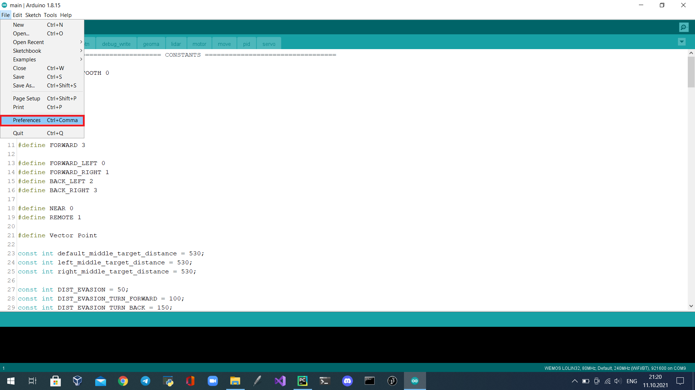
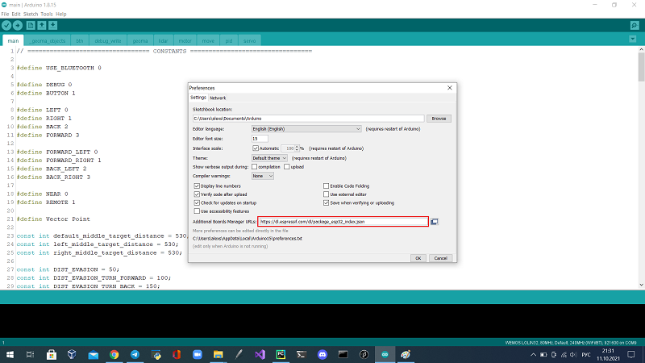
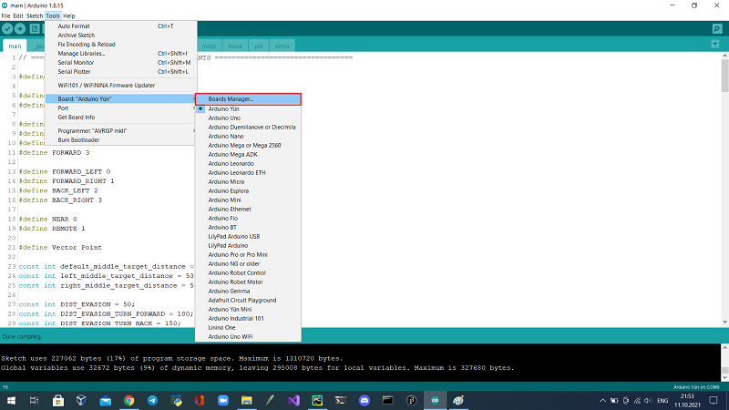
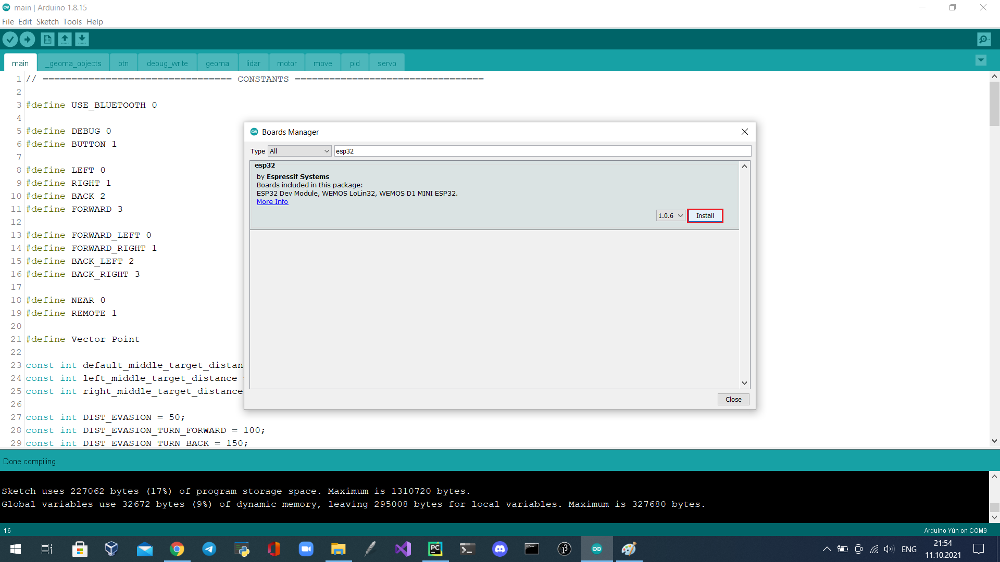
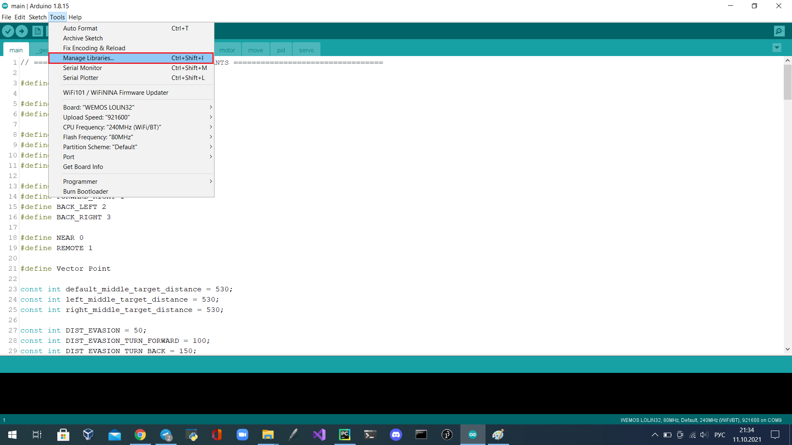
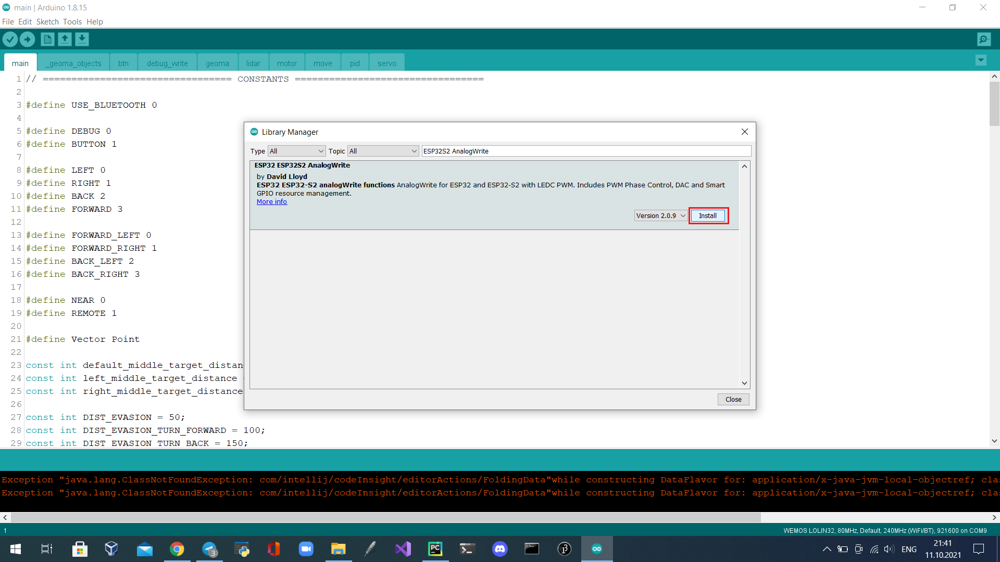
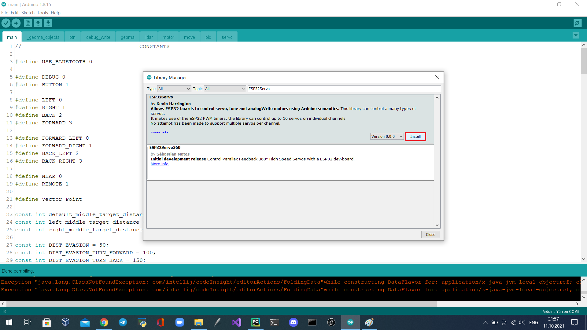
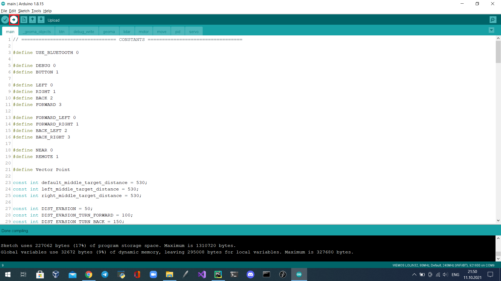

# Команда Кабинетный Болид

### Робот, созданный для решения задачи WRO FutureEngineers 2023
### © Федоров Тимофей, Беззубцев Федор

 

## Видео заезда нашего робота на [Youtube](...)

 

## Введение
  Перед нами стояла задача спроектировать и собрать беспилотное транспортное средство, которое могло бы верно и точно выполнить задачу WRO FutureEngineers 2023. Для достижения поставленных целей мы построили четырехколесного робота на базе ESP32. Основными датчикомами этого робота стали лидар и камер, которые дают информацию о расстоянии до объектов вокруг робота и цвете знаков перед роботом. При разработке были учтены геометрические особенности транспортных средств, такие как углы Аккермана и дифференциальная передача момента.

## Содержание репозитория
  - Папка "3D-models" содержит все версии робота
  - Папка "final/main" содержит код финального заезда
  - Папка "qual/main" содержит код для квалификационного заезда
  - Папка "schematic" содержит электромеханическую схему робота
  - Папка "team_photo" содержит два фото команды по регламенту
  - Папка "robot_photo" содержит обзорные фото робота с шести сторон
  - Папка "readme_photo" содержит фото, используемые в README.md файле

## Фото робота
  
  
  
  
  
  
  
  *Если картинки не открываются, проверьте папку "robot_photo", пожалуйста

## Схема электромеханического устройства
  
  
  *Если картинка не открывается или вам нужна картинка лучшего качества, проверьте папку "schematic", пожалуйста.

## Сборка робота
  - Сначала вам нужно напечатать все необходимые части робота. Для этого зайдите в папку "3D-models/RRO 2021 Mk. IV/STL" и распечатайте все модели на 3D-принтере.
  - Во-вторых, вам нужно купить все необходимые компоненты: [лидар](...), [камеру](...), [мотор](...), [сервопривод](...), [драйвер мотора](...) и [плату ESP Lolin32](...), а также компоненты, задействованные в печатной плате робота. Для робота также необходимы 4 подшипника 3x8x3, 2 подшипника 3x8x4, латунные втулки 3x5x4, [дифференциал](...) и четыре силиконовые [шины Pololu](...). Для питания робота можно использовать любую 7.4V 2S Li-Po батарею размером 53x30x11.5мм, например, мы используем вот эту [батарею](...).  
  - В-третьих, для сборки напечатаных и купленных компонентов понадобится 12 гаек M3 и 10 гаек М2 гаек и следующие винты(размер указан от головки до конца резьбы):
    - 2xM3 7.6мм (с потайной головкой)
    - 2xM3 20.8мм (с потайной головкой)
    - 2xM3 16.25мм (с потайной головкой)
    - 4xM3 16.25мм (с потайной головкой)
    - 16xM3 6.5мм (с потайной головкой)
    - 4xM3 33.8мм
    - 2xM2 7мм
    - 2xM2 8.8мм
    - 8xM2 6,5мм (с потайной головкой)
    - 6xM2 10мм (с потайной головкой)
  - В-четвертых, в соответствии со схемой, необходимо иметь макетную плату размером не более 55,8x25,4 мм. Рекомендуется использовать штырьевой разъем и гребенку-гнездо для удобства замены сгоревших компонентов. Плата управления должна быть собрана в следующем порядке: ESP Lolin32, плата шилда и драйвер.
  - В-пятых, открыв в файл-сборку "...", соберите робота, как показано на модели.

## О наших электрических и механических компонентах

### Лидар
  В нашем роботе используется LD19. Он основан на принципе лазерной триангуляции расстояния и использует высокоскоростной процессор для сбора и обработки данных. Система измеряет данные о расстоянии более 4500 раз в секунду. Дальномер LD19 вращается по часовой стрелке и выполняет 360-градусное лазерное сканирование окружающего пространства. Полученные данные преобразуются главным микроконтроллером для построения виртуальных стен.

### Камера
  Для определения цвета знаков мы решили использовать модуль технического зрения OpenMV. Он является сенсорным устройством для исследования окружающего пространства путем обработки и анализа изображения со встроенной видеокамеры.

### DRV8833
  Для управления двигателями используется драйвер DRV8833, который позволяет управлять двумя коллекторными двигателями одновременно(мы используем один маршевый двигатель). Внутри микросхема драйвера содержит два независимых Н-моста, рассчитанных на напряжение от 2,7 до 10,8 В, с рабочим током каждого канала до 0,5 А без радиатора или до 1,5 А с установленным на микросхеме радиатором.

### Металлический мотор-редуктор Polulu
  Этот мотор-редуктор представляет собой миниатюрный двигатель постоянного тока средней мощности с обмоткой на 6 В и металлическим редуктором. Его поперечное сечение составляет 10 × 12 мм, а D-образный выходной вал редуктора имеет длину 9 мм и диаметр 3 мм.
  Эти миниатюрные щеточные моторы-редукторы постоянного тока выпускаются в широком диапазоне передаточных чисел - от 5:1 до 1000:1 - и с пятью различными двигателями: мощными 6 В и 12 В с угольными щетками с длительным сроком службы (HPCB), а также двигателями высокой (HP), средней (MP) и малой (LP) мощности 6 В с щетками из драгоценных металлов с меньшим сроком службы. Двигатели HPCB на 6 В и 12 В обладают одинаковой производительностью при соответствующих номинальных напряжениях, только двигатель на 12 В потребляет вдвое меньше тока, чем двигатель на 6 В. В нашем роботе используется двигатель 50:1 HPCB на 6 В.

### Сервопривод MG90S
  MG90S - это маленький сервопривод похожий на популярную версию MG90. Так почему мы не использовать его синий аналог? Ответ прост - металлический редуктор. Благодаря им сервопривод может приложить большое усилие для поворота колес без каких-либо последствий. С помощью этого сервопривода робот может довольно точно задать угол поворота колес. 

## Установка необходимых программ и прошивка платы

  - Для программирования робота вам понадобится [Arduino IDE](https://www.arduino.cc/en/software). Это программное обеспечение с открытым исходным кодом позволяет легко писать код и загружать его в плату. Откройте exe-файл и следуйте инструкциям программы установки.

  - Установите ESP32 в менеджере плат Arduino IDE, добавив ссылку (https://dl.espressif.com/dl/package_esp32_index.json) в настройки IDE.
    - Сначала добавьте дополнительные ссылки менеджера плат
    
    
    - Во-вторых, установите плату
    
    
  - Используйте менеджер библиотек для установки библиотек ESP32.
  
    - Библиотеку для аналогового порта ESP32.
    
    - И библиотеку ESP32Servo.
    
  - Выберите плату "WEMOS LOLIN32". Подключите плату ESP32 с помощью кабеля microUSB к компьютеру и выберите соответствующий порт в IDE arduino. Нажмите кнопку "Загрузить".
  

## Запуск робота

 - Загрузить в робота нужный код
 - Включите робота с помощью тумблера.
 - Проведите жеребьевку, как указано в правилах
 - Поставьте робота на стартувую позицию
 - Нажмите кнопку для запуска

