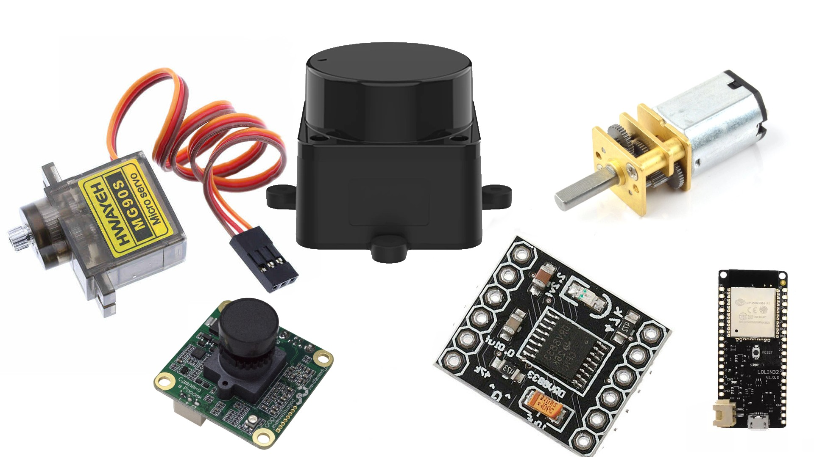

# Команда Кабинетный Болид

### Робот, созданный для решения задачи WRO FutureEngineers 2023
### © Беззубцев Федор, Федоров Тимофей 

## Наши фотографии
  
  
 

## Видео заезда нашего робота на [Youtube](https://www.youtube.com/watch?v=HyZGGjBNKJ4&ab_channel=qZer0)
 

## Предисловие
  Перед нами стояла задача спроектировать и собрать беспилотное транспортное средство, которое могло бы верно и точно выполнить задачу WRO FutureEngineers 2023. Для достижения поставленных целей мы построили четырехколесного робота на базе ESP32. Основными датчикомами этого робота стали лидар и камера, которые дают информацию о расстоянии до объектов вокруг робота и цвете знаков перед роботом. При разработке были учтены геометрические особенности транспортных средств, такие как углы Аккермана и дифференциальная передача момента.

## Содержание репозитория
  - Папка "Robot models" содержит все модели старой версии робота
  - Папка "Final code" содержит код робота
  - Папка "schematic" содержит электромеханическую схему робота
  - Папка "team_photo" содержит два фото команды по регламенту
  - Папка "robot_photo" содержит обзорные фото робота с шести сторон
  - Папка "readme_photo" содержит фото, используемые в README.md файле

## Фото робота
  Здесь представлены фото робота спереди, сзади, справа, слева, сверху и снизу.
  
  
  
  
  
  
  
  *Если картинки не открываются, проверьте папку "robot_photo", пожалуйста
  
## Подсистема перемещения робота
  Для движения робота вперёд используется коллекторный двигатель с редуктором. Задние колёса соеденены с мотором при помощи дифференциала, который позволяет роботу правильно проходить повороты. Дифференциал закреплён к корпусу робота. Для контроля направления движения робота используется сервомотор MG90S с металлическим редуктором, а также система тяг и кулаков. Сервомотор вращает качалку, которая в свою очередь тянет тяги, которые врашают кулаки на которых закреплены передние колёса колёса. Для связи тяг и кулаков используется система из запресованных в пластик подшипников, подшипники соеденены между собой винтом. При расчёте системы рулевого управления использовались углы Аккермана.
### Фотографии системы рулевого управления
  

## О наших электрических и механических компонентах

### Лидар
  В нашем роботе используется LD19. Он основан на принципе лазерной триангуляции расстояния и использует высокоскоростной процессор для сбора и обработки данных. Система измеряет данные о расстоянии более 4500 раз в секунду. Дальномер LD19 вращается по часовой стрелке и выполняет 360-градусное лазерное сканирование окружающего пространства. Полученные данные преобразуются главным микроконтроллером для построения виртуальных стен. Данный лидар имелся в наличии и является достаточно простым для использования, поэтому мы решили использовать именно его.

### Камера
  Для определения цвета знаков было решено использовать модуль технического зрения TrackingCam. Он является сенсорным устройством для исследования окружающего пространства путем обработки и анализа изображения со встроенной видеокамеры. Данная камера проста в настройке и использовании.

### Драйвер двигателя
   В качестве драйвера двигателя используется модуль MOSFET транзистора D4184. Данный модуль неприхотлив, прост в использовании.

### Металлический мотор-редуктор Polulu
  Этот мотор-редуктор представляет собой миниатюрный двигатель постоянного тока средней мощности с обмоткой на 6 В и металлическим редуктором. Его поперечное сечение составляет 10 × 12 мм, а D-образный выходной вал редуктора имеет длину 9 мм и диаметр 3 мм.
  Эти миниатюрные щеточные моторы-редукторы постоянного тока выпускаются в широком диапазоне передаточных чисел - от 5:1 до 1000:1 - и с пятью различными двигателями: мощными 6 В и 12 В с угольными щетками с длительным сроком службы (HPCB), а также двигателями высокой (HP), средней (MP) и малой (LP) мощности 6 В с щетками из драгоценных металлов с меньшим сроком службы. Двигатели HPCB на 6 В и 12 В обладают одинаковой производительностью при соответствующих номинальных напряжениях, только двигатель на 12 В потребляет вдвое меньше тока, чем двигатель на 6 В. В нашем роботе используется двигатель 50:1 HPCB на 6 В.
  
### Магнитный энкодер Polulu
  На роботе команды "Кабинетный болид" закреплён магнитный энкодер pollulu. На валу мотора закреплён диск магнитная полярность которого различна в разных точках. Энкодер сосоит из двух датчиков хола смещённых на 90 градусов друг относительно друга. Мы получаем с энкодера два сигнала смены магнитной полярности смещённые на 90 градусов. Это позволяет точно определить скорость вращения мотора и поддерживать её постоянной на протежение всего заезда. Данный энкодер был специально спроектирован для линейки двигателей polulu и использовать другой(сторонний) энкодер было не целесообразно 

### Сервопривод MG90S
  MG90S - это маленький сервопривод похожий на популярную версию MG90. Так почему бы не использовать его синий аналог? Ответ прост - металлический редуктор. Благодаря ему сервопривод может приложить большое усилие для поворота колес без каких-либо последствий. С помощью этого сервопривода робот может довольно точно задать угол поворота колес. 
### ESP32
  Плата Lolin D32 основана на микроконтроллере ESP32 от "Espressif systems" с низким энергопотреблением. Она обладает множеством мощных функций, включая двухъядерный процессор на базе Arm, Wi-Fi, Bluetooth, I2C, I2S, SPI, АЦП, ЦАП и 4 Мб флэш-памяти. Модуль D32 предоставляет эти функции в удобном формате DIP и может быть запрограммирован непосредственно с USB-интерфейса - дополнительное оборудование для программирования не требуется.
  
### Печатная плата
  На печатной плате расположен контроллер ESP32 с необходимой обвязкой и программатором. Также печатная плата включает в себя понижающий преобразователь до 5V для питания камеры, лидара и серы, понижающий преобразователь до 3.3V для питания ESP32 и энкодера и повышающий преобразователь до 10v для питания мотора.
 
## Подсистема питания и сенсоры робота 

### Питание
  Источником питания робота является литий-полимерная батарея с номинальным напряжением 7.4 вольта. Для полного отключения питания робота, на плате размещен тумблер. На плате установлен делитель напряжения который позволяет контроллеру безопасно считать текущее напряжение акумулятора и предотвратить его разряд. На плате напряжение с акумулятора понижается до 5в при помощи схемы на основе модуля [MP1584](https://alex-exe.ru/radio/power/dc-dc-step-down-mp1584/) для подачи его на лидар серву и камеру, ESP32. Для подачи на драйвер двигателя напряжение с акумулятора повышается до 8в при помощи схемы на основе модуля [LM2577](https://ampero.ru/lm2577-voltage-regulator-povyshayuschiy-dc-dc-preobrazovatel-3v-34v-v-4v-35v.html). 
  
### Сенсоры
  Основным сенсором для определения стенок и кубиков является лидар, он позволяет узнавать расстояние до 300 точек вокруг робота с частотой обновления 15 раз в секунду. Поскольку лидар не имет возможности чётко определять цвет объекта перед роботом, для этой цели используется камера TrackingCam.

  
## Схема электромеханического устройства
  В этом блоке представлены фотографии общей схемы робота, а также схемы основной печатной платы робота. Файл схемы печатной платы можно найти [в этой папке](https://github.com/Timofei1412/Cabinet-car/blob/main/schematic).
  
  
  *Если картинка не открывается или вам нужна картинка лучшего качества, проверьте папку "schematic", пожалуйста.

## Сборка робота
  1) Необходимо напечатать все пластиковые части на 3D принтере. Для этого зайдите в папку "3D-models" и распечатайте все модели на 3D-принтере.
  2) Необходимо купить такие компоненты как: [Esp32 Lolin32](https://compacttool.ru/plata-razrabotchika-wemos-lolin32-esp-wroom-32-bluetooth-btblewifi),[Линейный понижатель]([https://www.wildberries.ru/catalog/145172339/detail.aspx](https://www.ozon.ru/product/ponizhayushchiy-preobrazovatel-napryazheniya-gsmin-mp1584en-dc-dc-zelenyy-285604865/?asb=uujFsyWmM5ZedbAN1P4vUE4Ul%252BvjDnRlTe9Ct5nkEX4%253D&asb2=7DaiogtcmMVU4mrKaqHwJffn-PwBVsE-z86YZYDSHlCm7M0cLorGFQkAnXwPXJMA&avtc=1&avte=4&avts=1687894174&keywords=mp1584en&sh=leogiH1JgA)),[Повышающий преобразователь](https://www.wildberries.ru/catalog/57613760/detail.aspx),[лидар LD-19](https://aliexpress.ru/item/1005004295339153.html?sku_id=12000031808972433), [камеру TrackingCam](https://robotbaza.ru/product/modul-tehnicheskogo-zreniya-trackingcam), [мотор Polulu](https://www.pololu.com/product/3063), [сервопривод SG-90S](https://ampero.ru/mg90s-servoprivod-dlya-proektov-arduino.html), [драйвер мотора](https://www.wildberries.ru/catalog/60795780/detail.aspx), спаяйте печатную плату робота (папка "schematic"). Для робота также необходимы 4 подшипника 3x9x7, 16 подшипников 2x5x2.5, 2 подшипника 10x15x6, латунные втулки 3x6x4, [дифференциал](https://rc-today.ru/product/differencial-hsp-60065/) и четыре силиконовые [шины Pololu](https://www.pololu.com/product/3408). Для питания робота можно использовать любую 7.4V 2S Li-Po батарею размером 53x30x11.5мм, например, мы используем вот эту [батарею](http://realrc.ru/product.php?id_product=416).  
  2) Необходимо купить такие компоненты как: [Esp32 Lolin32](https://compacttool.ru/plata-razrabotchika-wemos-lolin32-esp-wroom-32-bluetooth-btblewifi),[Линейный понижатель](),,[лидар LD-19](https://aliexpress.ru/item/1005004295339153.html?sku_id=12000031808972433), [камеру TrackingCam](https://robotbaza.ru/product/modul-tehnicheskogo-zreniya-trackingcam), [мотор Polulu](https://www.pololu.com/product/3063), [сервопривод SG-90S](https://ampero.ru/mg90s-servoprivod-dlya-proektov-arduino.html), [драйвер мотора](https://www.wildberries.ru/catalog/60795780/detail.aspx), спаяйте печатную плату робота (папка "schematic"). Для робота также необходимы 4 подшипника 3x9x7, 16 подшипников 2x5x2.5, 2 подшипника 10x15x6, латунные втулки 3x6x4, [дифференциал](https://rc-today.ru/product/differencial-hsp-60065/) и четыре силиконовые [шины Pololu](https://www.pololu.com/product/3408). Для питания робота можно использовать любую 7.4V 2S Li-Po батарею размером 53x30x11.5мм, например, мы используем вот эту [батарею](http://realrc.ru/product.php?id_product=416).  
  3) Для сборки напечатаных и купленных компонентов понадобится 16 винтов и гаек различных размеров(М3 /16, /10... и М2 /10):
  4) В соответствии с файлом печатной платы, необходимо напаять компоненты на неё.
  5) Открыв 3Д файл робота в [папке](https://github.com/Timofei1412/Cabinet-car/tree/main/New%20robot%20models), соберите робота, как показано на модели.

 
## Распознование стенок и препядствий
  Для распознования стенок используется алгоритм апроксимации набора точек до прямой. Робот путём геометрических вычеслений, определяет расстояние до правой стенки, и поддерживает его при помощи пид регулятора. Для поворота в нужное время робот определяет расстояние до передней стенки, и поаорачивает когда приближаетсяк передней стенки на заданное расстояние. Выход из поворота осуществлюется тогда, когда робот выравнивает себя относительно правой стенки. Для распознования кубиков робот вычесляет свои координаты используя расстояние до правой и передней стенки, далее смотрит есть ли какие либо точки в местах, где должны располагатся кубики, если такие точки есть, то кубик есть, а если нет, то кубика нет. Для определения цвета кубика используются данные с камеры.
  
## Установка необходимых программ и прошивка платы

  - Для программирования робота вам понадобится [Arduino IDE](https://www.arduino.cc/en/software). Это программное обеспечение с открытым исходным кодом позволяет легко писать код и загружать его в плату. Откройте exe-файл и следуйте инструкциям программы установки.

  - Установите ESP32 в менеджере плат Arduino IDE, добавив ссылку (https://dl.espressif.com/dl/package_esp32_index.json) в настройки IDE.
    - Сначала добавьте дополнительные ссылки менеджера плат
    
    
    - Во-вторых, установите плату
    
    
  - Используйте менеджер библиотек для установки библиотек ESP32.
  
    - Библиотеку для аналогового порта ESP32.
    
    - И библиотеку ESP32Servo.
    
  - Выберите плату "WEMOS LOLIN32". Подключите плату с ESP32 с помощью кабеля USB C к компьютеру и выберите соответствующий порт в IDE arduino. Нажмите кнопку "Загрузить".
  
  
  - Также вам понадобится[TrackingCam](https://appliedrobotics.ru/?page_id=633). Скачайте и откройте exe-файл и следуйте инструкциям программы установки.
  - После скачивания откройте программу и настройте камеру.
    - Подключите камеру к компьютеру и откройте программу.
    - Подберите настройки для зеленого и красного кубика(не забудьте переключить поиск(полоска снизу)на блоб два, после настройки первого кубика, иначе настройки запишутся поверх прошлых)
 

## Запуск робота

 - Загрузить в робота нужный код
 - Включите робота нажатием на кнопку с фиксацией.
 - Проведите жеребьевку, как указано в правилах
 - Поставьте робота на стартувую позицию
 - Нажмите кнопку для запуска

